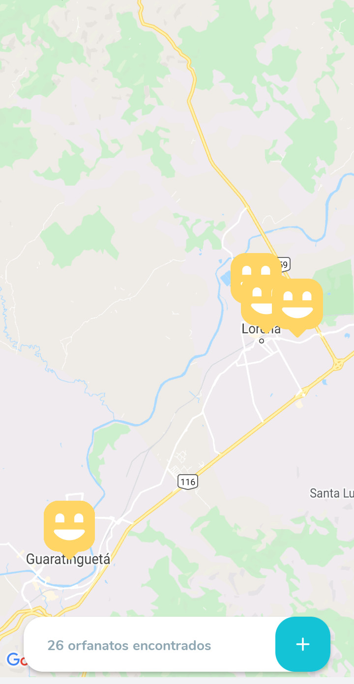
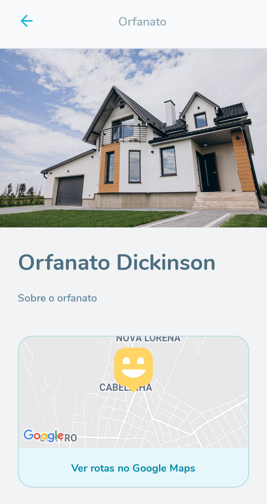
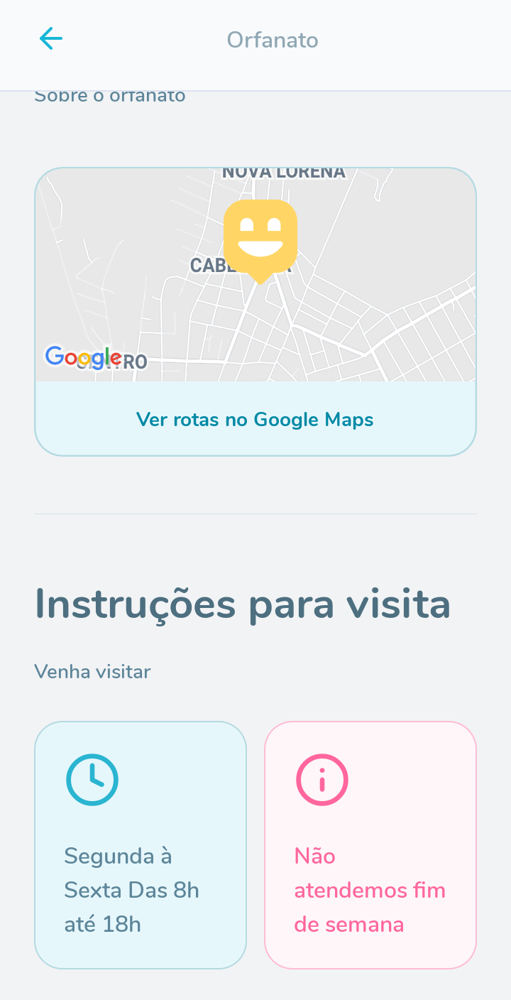
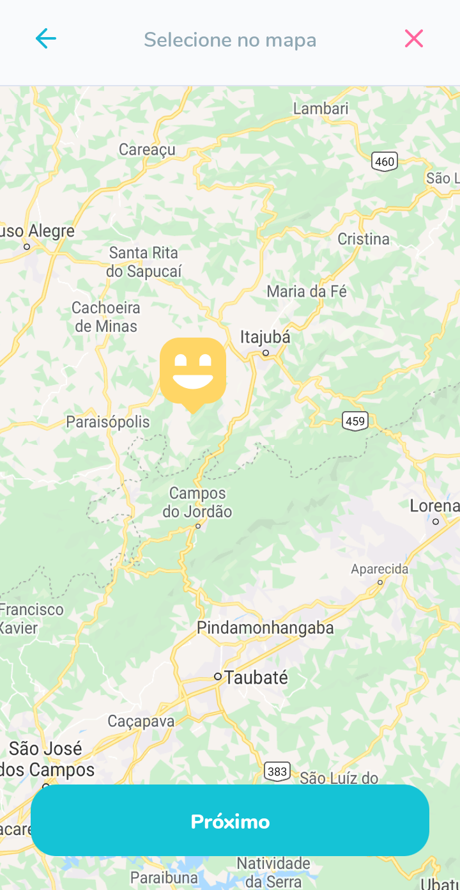
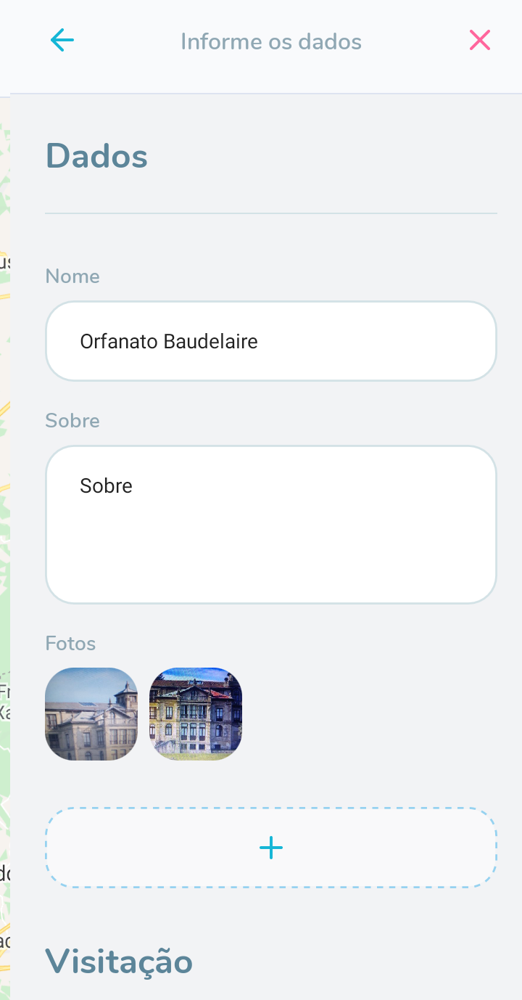
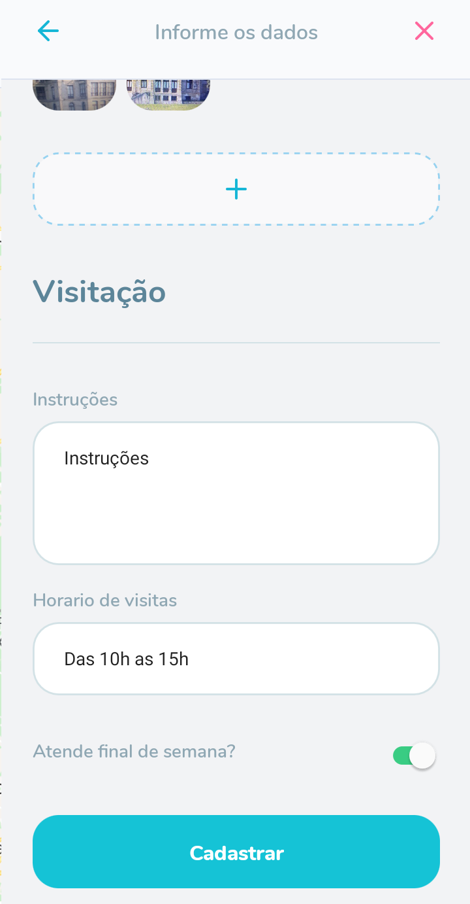

<h3 align="center">
    
</h3>


<br> 

<p align="center"> 🚀 <strong>Happy - 3º NLW</strong> 🚧
 </p>
 
<br>

<p align="center">
   
  
  <a href="https://github.com/savio-2-lopes">
    
  </a>
 
 <a href="https://github.com/savio-2-lopes">
    
  </a>
</p>

<br> 

## :pushpin: Índice

- [Sobre](#sobre-o-projeto)
- [Layout](#layout)
- [Como Executar](#executar)
- [Tecnologias](#tecnologias)
- [Licença](#licenca)
- [Autor](#autor)

<br>

<a id="sobre-o-projeto"></a>

## 💻 Sobre o projeto

🚀 **Happy** - é uma plataforma online para encontrar e facilitar visitas em orfanatos.

Projeto desenvolvido durante a **3º edição da NLW - Next Level Week** oferecida pela [Rocketseat](https://blog.rocketseat.com.br).

<br>

<a id="layout"></a>

## 🎨 Layout

<br>

💡 Este projeto é divido em três partes:
- [Frontend](#w)
- [Backend](#b)
- [Mobile](#m)

<br>

<a id="w"></a>
### Web

<p align="center" style="display: flex; align-items: flex-start; justify-content: center;">
  
</p>

<br>

<a id="b"></a>
### Backend

<p align="center" style="display: flex; align-items: flex-start; justify-content: center;">
  
</p>

<br>

<a id="m"></a>
### Mobile

<p align="center">
  
  
  
  
  
  
</p>

<br>

<a id="executar"></a>

## 🚀 Como executar o projeto

### Pré-requisitos

Antes de começar, você vai precisar ter instalado em sua máquina as seguintes ferramentas:
[Git](https://git-scm.com), [Node.js](https://nodejs.org/en/) e o gerenciador de pacotes [Yarn](https://yarnpkg.com).
Além disto é bom ter um editor para trabalhar com o código como [VSCode](https://code.visualstudio.com/)

<br>

💡 Tanto o Frontend quanto o Mobile precisam que o Backend esteja sendo executado para funcionar.

<br>

Este projeto é divido em três partes:
- [Frontend](#w)
- [Backend](#b)
- [Mobile](#m)

<br>

<a id="w"></a>

#### 🧭 Rodando a aplicação web (Frontend)

```bash

# Clone este repositório
$ git clone https://github.com/savio-2-lopes/Happy.git

# Acesse a pasta do projeto no terminal/cmd
$ cd Happy

# Vá para a pasta da aplicação Front End
$ cd frontend

# Instale as dependências
$ npm install

# Execute a aplicação em modo de desenvolvimento
$ yarn start

# A aplicação será aberta na porta:3000 - acesse http://localhost:3000

```

<br>

<a id="b"></a>
#### 🎲 Rodando o server (Backend)

```bash

# Clone este repositório
$ git clone https://github.com/savio-2-lopes/Happy.git

# Acesse a pasta do projeto no terminal/cmd
$ cd Happy

# Vá para a pasta da aplicação Backend
$ cd backend

# Instale as dependências
$ npm install

# Crie as tabelas do banco de dados
$ yarn typeorm migration:run 

# Execute a aplicação em modo de desenvolvimento
$ yarn start

# A aplicação será aberta na porta:3333 - acesse http://localhost:3333

```
<br>

<a id="m"></a>
#### 📱 Rodando a aplicação mobile (Mobile)

```bash

# Clone este repositório
$ git clone https://github.com/savio-2-lopes/Happy.git

# Acesse a pasta do projeto no terminal/cmd
$ cd Happy

# Vá para a pasta da aplicação Front End
$ cd mobile

# Instale as dependências
$ npm install

# Execute a aplicação em modo de desenvolvimento
$ yarn start

# A aplicação será aberta no navegador

```

<br>

<a id="tecnologias"></a>

## 🛠 Tecnologias

As seguintes ferramentas foram usadas na construção do projeto:

- [TypeScript](https://www.typescriptlang.org/)
- [Node.js](https://nodejs.org/en/)
- [React](https://reactjs.org)
- [React Native](https://facebook.github.io/react-native/)
- [Expo](https://expo.io/)

<br>

<a id="licenca"></a>

## :memo: Licença

Este projeto está sob a licença do MIT. Veja a [página de licença](https://opensource.org/licenses/MIT) para mais detalhes.

<br>

<a id="autor"></a>

## 🦸 Autor

[](https://github.com/savio-2-lopes) 
[](https://www.instagram.com/savioaugulopes/) 
[](https://www.linkedin.com/in/savio-lopes/) 
[](mailto:savio.dev.lopes@gmail.com) 

Feito com ❤️ por Savio Lopes 👋🏽 [Entre em contato!](https://www.linkedin.com/in/savio-lopes/)

<br>

<a id="agradecimento"></a>

## 💙 Agradecimentos

Obrigado [Rocketseat](https://rocketseat.com.br/) por disponibilizar esse conteúdo sensacional 🚀.
