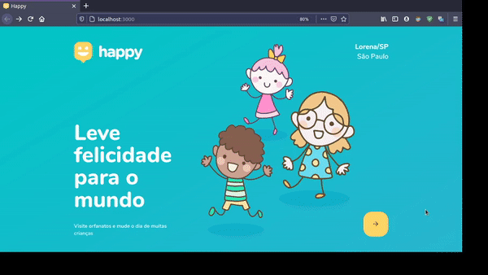

<h1 align="center">
    
</h1>

<h4 align="center"> 
	🚧  Happy :memo: Em andamento ... 🚀 🚧
</h4>

<br>

## :memo: Índice

- [Sobre](#sobre-o-projeto)
- [Layout](#layout)
- [Como Executar](#executar)
- [Tecnologias utilizadas](#tecnologias)
- [Autor](#autor)

<br>

<a id="sobre-o-projeto"></a>

## 💻 Sobre o projeto

:memo: Happy - é uma plataforma online para encontrar orfanatos e facilitar visitas.

Projeto desenvolvido durante a **3º edição da NLW - Next Level Week** oferecida pela [Rocketseat](https://blog.rocketseat.com.br).

<br>

<a id="layout"></a>

## 🎨 Layout

### Web

<p align="center" style="display: flex; align-items: flex-start; justify-content: center;">
  
  
</p>

<br>

<a id="executar"></a>

## 🚀 Como executar o projeto

<br>

### Pré-requisitos

Antes de começar, você vai precisar ter instalado em sua máquina as seguintes ferramentas:
[Git](https://git-scm.com), [Node.js](https://nodejs.org/en/) e o gerenciador de pacotes [Yarn](https://yarnpkg.com).
Além disto é bom ter um editor para trabalhar com o código como [VSCode](https://code.visualstudio.com/)

<br>

#### 🧭 Rodando a aplicação web (Frontend)

```bash

# Clone este repositório
$ git clone https://github.com/savio-2-lopes/Happy.git

# Acesse a pasta do projeto no terminal/cmd
$ cd Happy

# Vá para a pasta da aplicação Front End
$ cd frontend

# Instale as dependências
$ yarn add

# Execute a aplicação em modo de desenvolvimento
$ yarn start

# A aplicação será aberta na porta:3000 - acesse http://localhost:3000

```

<br>

<a id="tecnologias"></a>

## 🛠 Tecnologias

As seguintes ferramentas foram usadas na construção do projeto:

#### **Website**  ([React](https://reactjs.org/)  +  [TypeScript](https://www.typescriptlang.org/))

-   **[React Router Dom](https://github.com/ReactTraining/react-router/tree/master/packages/react-router-dom)**
-   **[React Icons](https://react-icons.github.io/react-icons/)**
-   **[React-scripts](https://github.com/facebook/create-react-app/tree/master/packages/react-scripts)**
-   **[React-dom](https://github.com/facebook/react/tree/master/packages/react-dom)**
-   **[React-Leaflet](https://react-leaflet.js.org/)**
-   **[Typescript](https://github.com/microsoft/TypeScript)**
<br>

<a id="autor"></a>

## 🦸 Autor

<a href="https://github.com/savio-2-lopes">
 
 <br>
 <sub><b>    Savio Lopes </b></sub></a> <a href="https://github.com/savio-2-lopes" title="Github">  🚀</a>
 <br>
 
[](https://www.linkedin.com/in/savio-lopes/) 
[](https://github.com/savio-2-lopes)
[](https://api.whatsapp.com/send?phone=12996798894&text=Hello!)
[](mailto:savioaugulopes@gmail.com)


Feito com ❤️ por Savio Lopes 👋🏽 [Entre em contato!](https://www.linkedin.com/in/savio-lopes/)
